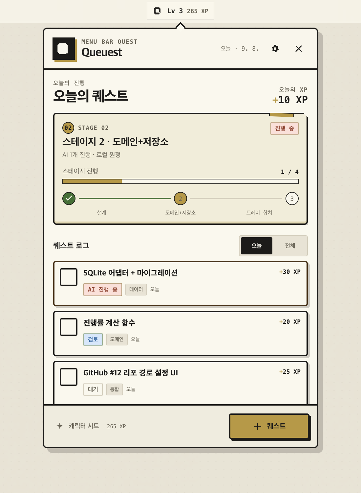

# Queuest

> Life is a queue of quests.

게임 요소와 외부 연동의 의미는 [퀘스트 시스템](./docs/quest-system.md)에 정의합니다.
퀘스트 편집에서 목표·이유·다음 행동, 메인/서브·반복·도전 분류, 외부 링크와 수행 시간을
저장하고 할 일 화면에서 미완료 퀘스트를 추적할 수 있습니다.

개인 프로젝트를 원정(프로젝트) → 스테이지(마일스톤) → 퀘스트(태스크)로 관리하는 macOS 메뉴바 앱입니다.

현재 레포는 `Tauri 2 + React + TypeScript + SQLite` 기반의 로컬 MVP입니다. 앱은 SQLite 인박스와 프로젝트 할 일 목록을 먼저 열고, 프로젝트 보드나 전역 캐릭터 탭에서 필요할 때만 전체 워크스페이스·프로젝트·마일스톤·태스크 그래프를 불러옵니다. 워크스페이스와 프로젝트·마일스톤·태스크 CRUD, 보드 상태 이동은 로컬 SQLite에 즉시 저장되고, 태스크 댓글·전역 캐릭터·프로젝트 장비 설정도 재실행 시 복원할 수 있는 저장 경계를 갖습니다. 메뉴바 팝오버는 포커스와 핀 상태를 반영하며 도구 상태를 확인합니다. 외부 연동은 `@queuest/plugin-contracts`의 버전 있는 프로토콜과 [플러그인 아키텍처](./docs/plugin-architecture.md)를 기준으로 확장합니다.

## 미리보기

macOS 메뉴바에서 Queuest 아이콘을 클릭하면 아이콘 바로 아래에 팝오버가 열립니다. 우클릭 메뉴로 열어도 같은 위치를 사용하며, 화면 좌우 경계를 넘지 않도록 배치합니다.

- 상단의 **할 일 / 프로젝트 / 캐릭터 / 플러그인** 메뉴는 스크롤해도 유지됩니다.
- 캐릭터 이름과 직업은 **캐릭터** 탭에서 전역으로 편집합니다. 경험치·레벨·스킬은 모든 프로젝트의 완료 기록을 합산하고, 프로젝트별 장비 설정은 프로젝트 설정에 남습니다.
- **할 일** 탭에서 개인 인박스와 모든 프로젝트의 퀘스트를 함께 확인할 수 있습니다. 프로젝트 퀘스트에서 프로젝트 보드와 외부 원본 링크로 바로 이동합니다.
- 플러그인 화면에서 로컬 도구의 설치·인증 상태를 다시 확인할 수 있습니다. GitHub는 프로젝트의 작업 폴더와 `gh` 인증으로 이슈를 가져오며, 할 일 화면에서 나에게 리뷰 요청된 PR을 조회할 수 있습니다. Jira는 저장된 연결로 프로젝트 티켓과 보드 백로그를 가져옵니다. Calendar·EventKit 항목 가져오기는 후속 범위입니다.
- 420px 창에서는 퀘스트 상태 보드를 세로로 표시합니다. 고정 버튼을 누르면 다른 앱으로 이동해도 창이 유지됩니다.

아래 이미지는 초기 디자인 미리보기로, 현재 화면 전환 메뉴와는 차이가 있습니다.



## 디자인 시스템

새 UI 기능은 [디자인 시스템](./docs/design-system.md)을 기준으로 구현합니다. 승인된 레트로 웹 미리보기, 공용 토큰·컴포넌트, 화면별 패턴과 검수 절차를 담고 있습니다. [AGENTS.md](./AGENTS.md)에 구현 전 필수 참고 지침을 연결했습니다.

## 구조

```text
apps/desktop              Tauri 셸과 React UI
packages/domain           순수 도메인 모델과 계산 규칙
packages/ports            저장소·에이전트 포트
packages/plugin-contracts 외부 플러그인 manifest·프로토콜·정규화 타입
packages/plugin-sdk       외부 프로세스 플러그인용 JSON 프로토콜 SDK
packages/plugin-manager  플러그인 발견·검증·수명주기·stdio 전송 런타임
packages/plugin-permissions 권한 정규화·승인 브로커·Credential Store 경계
packages/plugin-github   GitHub API 읽기 전용 process connector
packages/plugin-jira     Jira Cloud API 읽기 전용 process connector
packages/plugin-calendar Google Calendar 읽기 전용 process connector
packages/plugin-eventkit 공통 Swift EventKit native helper와 JSONL 경계
packages/plugin-apple-calendar Apple Calendar EventKit 읽기 전용 process connector
packages/plugin-apple-reminders Apple Reminders EventKit 읽기 전용 process connector
packages/adapter-sqlite   Tauri SQL 기반 로컬 SQLite 어댑터
packages/adapter-claude   claude -p 실행 어댑터
packages/adapter-github   GitHub 이슈 조회·Task 변환·원본 링크 어댑터
```

## 시작

```bash
npm install
npm run dev
```

Tauri 앱까지 실행하려면 다음을 사용합니다.

```bash
npm run tauri -- dev
```

검증 명령은 다음과 같습니다.

```bash
npm run check
```

기능 구현 순서는 [ROADMAP.md](./ROADMAP.md)에 기록되어 있습니다.

## 범위 메모

- 엔티티 ID는 UUID 문자열을 사용합니다.
- 상태는 `todo → doing → review → done` 네 가지입니다. `blocked`는 플래그입니다.
- XP·레벨·스킬은 저장하지 않고 태스크와 마일스톤에서 계산합니다.
- AI 실행 결과는 `review`로 돌아오며 `done` 처리는 사람의 몫입니다.
- 외부 연동은 플러그인에서 앱으로 가져오는 단방향 흐름부터 둡니다.
- 플러그인 탭에서 GitHub·Jira·Google Calendar·Apple EventKit 연결 프로필을 저장하고
  다시 편집·삭제할 수 있습니다. 연결 메타데이터와 캘린더 ID는 SQLite에, API token과
  access token은 `com.yoonhogo.queuest.credentials.plugin.<pluginId>.<connectionId>`
  규칙의 macOS Keychain에 저장하며, 토큰은 웹 화면이나 SQLite로 되돌려 읽지 않습니다.
  Google Calendar의 OAuth 동의·token refresh와 Apple EventKit TCC 요청 화면은 후속 범위입니다.
- GitHub connector는 `com.queuest.github` plugin namespace와 `connectionId`를 조합한
  Credential Store 항목을 읽고, GitHub REST GET만 수행합니다. 앱에서는 프로젝트의
  `repoPath`와 `gh` 인증을 통해 이슈를 읽어 선택한 스테이지의 로컬 Task로 저장하며,
  `externalRef`로 중복을 막고 원본 URL을 보존합니다. GitHub에 쓰는 흐름은 읽기 전용 범위
  밖입니다.
- Jira Cloud connector는 `com.queuest.jira` plugin namespace와 `connectionId`로 Credential
  Store 항목을 읽고, 다음 JSON credential을 사용합니다. `siteUrl`은 `baseUrl`로 대체할 수
  있으며 둘 다 있으면 같은 값이어야 합니다.

  ```json
  {"siteUrl":"https://<tenant>.atlassian.net","email":"account@example.com","apiToken":"<token>"}
  ```

  기본 macOS Keychain namespace는 service
  `com.yoonhogo.queuest.credentials.plugin.com.queuest.jira`, account
  `com.yoonhogo.queuest.credentials.plugin.com.queuest.jira.<connectionId>`입니다. HTTPS
  Atlassian Cloud subdomain(`*.atlassian.net`) origin만 허용하며 path·port·query·fragment·
  userinfo나 임의 host는 거부합니다. manifest의 `network: ["*.atlassian.net"]`와
  `secrets: ["jira"]`를 모두 승인한 뒤에만 credential/API를 사용하고, email과 API token으로
  Basic auth를 구성해 `/rest/api/3/search/jql`(POST)과 `/rest/api/3/myself`(GET)만 호출합니다.
  project JQL과 bounded opaque `nextPageToken` pagination을 사용해 Jira issue를
  `ExternalWorkItem`으로 매핑하며, ADF 또는 문자열 description·labels·updatedAt·status
  category·browse URL을 보존합니다. `health.check`는 초기화·권한만 확인하고 credential/API를
  읽지 않으며, credential/auth/not-found/rate-limit/HTTP/malformed/network 실패는 token을
  노출하지 않는 typed error와 connection state로 전달합니다. 연결 설정은 플러그인 탭에서
  저장합니다. 데스크톱 UI 가져오기는 아래의 별도 native Host adapter를 사용합니다.
  provider write, OAuth/3LO, self-hosted Jira/Data Center는 지원하지 않습니다.
- Google Calendar connector는 `com.queuest.calendar` plugin namespace와 `connectionId`를
  조합한 Credential Store 항목을 읽고, 다음 JSON credential의 `accessToken`만 사용합니다.

  ```json
  {"accessToken":"<oauth-access-token>"}
  ```

  기본 macOS Keychain namespace는 service
  `com.yoonhogo.queuest.credentials.plugin.com.queuest.calendar`, account
  `com.yoonhogo.queuest.credentials.plugin.com.queuest.calendar.<connectionId>`입니다.
  manifest는 `network: ["www.googleapis.com"]`와 `secrets: ["calendar"]`만 선언하며
  filesystem 권한은 없습니다. 두 권한을 모두 승인한 뒤에만 credential/API를 사용하고,
  고정된 Google Calendar API에서 기간·캘린더별 일정 목록을 GET으로 조회합니다. timed/all-day
  event와 `confirmed`·`tentative`·`cancelled` 상태, 원본 URL·수정 시각을
  `ExternalCalendarEvent`로 매핑하며 `maxResults=2500`과 bounded opaque page cursor를 사용합니다.
  `health.check`는 초기화·권한만 확인하고 credential/API를 읽지 않으며,
  `connection.status`만 credential을 읽어 primary calendar를 확인합니다. credential/auth/
  not-found/rate-limit/HTTP/malformed/network 실패는 token을 노출하지 않는 typed error와
  connection state로 전달합니다. OAuth 동의·authorization code 교환·token refresh와
  `accessToken`을 Credential Store에 넣는 provisioning은 Host/UI 경계이며 이 read-only
  connector에 포함하지 않습니다. 연결 설정은 플러그인 탭에서 access token을 Keychain에
  보관할 수 있지만, 일정 쓰기, UI import, CalendarEvent 저장과 Task 변환은 아직 연결하지
  않습니다.
- Apple EventKit connector는 `com.queuest.apple-calendar`와
  `com.queuest.apple-reminders` 두 개의 process plugin으로 제공됩니다. 각각
  `source.calendar-events` 또는 `source.work-items` capability와
  `macos.eventkit.calendar` 또는 `macos.eventkit.reminders` platform permission만
  선언하며, network·secret·filesystem 권한과 OAuth credential을 요구하지 않습니다.
  Host의 Permission Broker 승인이 process spawn보다 먼저 필요하고, 그 다음에도 macOS의
  EventKit TCC 사용자 승인이 별도로 필요합니다.

  EventKit은 읽기 전용 권한을 제공하지 않으므로 일정과 미리알림 목록을 읽으려면
  macOS 14 이상에서 각각 full access를 허용해야 합니다. Swift helper는
  `requestFullAccessToEvents`/`requestFullAccessToReminders`를 사용하고, 구버전 macOS에서는
  호환용 `requestAccess`로 폴백합니다. TCC 요청은 `tcc.request-access`에서만 수행하며,
  `health.check`는 권한을 자동으로 요청하지 않습니다. 앱과 helper에는
  `NSCalendarsFullAccessUsageDescription`·`NSRemindersFullAccessUsageDescription`가
  포함되고, 샌드박스/하드닝 배포에는 Calendar entitlement와 사용자 승인이 함께 필요합니다.

  native helper는 [packages/plugin-eventkit/native/build.sh](./packages/plugin-eventkit/native/build.sh)가
  EventKit 프레임워크와 usage-description Info.plist를 함께 빌드하고 로컬에서는 ad-hoc
  서명합니다. Tauri bundle은 `Contents/Resources/eventkit/queuest-eventkit`으로 helper를
  포함합니다. 배포용 서명은 앱과 같은 Team ID의 Developer ID identity를 지정해야 합니다.

  ```bash
  npm run build:native --workspace @queuest/plugin-eventkit
  QUEUEST_EVENTKIT_CODESIGN_IDENTITY="Developer ID Application: <name> (<team-id>)" \
    npm run build:native --workspace @queuest/plugin-eventkit
  npm run tauri -- build
  ```

  현재 EventKit plugin은 로컬 EventKit 데이터의 목록 조회와 연결/TCC 상태 확인을
  구현합니다. 플러그인 탭에서 비밀 없는 연결 ID와 Calendar ID를 저장할 수 있으며,
  OAuth 동의·authorization code·refresh token·Keychain provisioning은 필요하지 않습니다.
  TCC 요청 안내, 일정/미리알림 UI, CalendarEvent·Task 저장과 중복 제거, 외부 데이터
  생성·수정·삭제(write)는 아직 Host/UI 범위에 연결하지 않았습니다.
- 커밋·푸시·클라우드 동기화·팀 공유는 이 초기화 범위에 포함하지 않습니다.

## GitHub PR과 Jira 가져오기

- **할 일 → 확인할 GitHub PR → PR 조회**: `gh`에 로그인한 계정에 리뷰 요청된 열린 PR을
  모든 저장소에서 최근 업데이트 순 최대 100개 표시합니다. PR 열기는 원본으로 이동하며
  로컬 퀘스트나 Jira를 변경하지 않습니다. GitHub 연결 프로필의 PAT가 아닌 `gh` 인증을 씁니다.
- **플러그인 → Jira 연결**에 사이트 URL·이메일·API token·프로젝트 키를 저장합니다.
  백로그 조회에는 보드 URL의 `boards/123` 또는 `rapidView=123`에 있는 숫자를
  **백로그 보드 ID**에 추가합니다. 사이트나 이메일을 바꿀 때는 API token도 다시 저장하세요.
- **원정 → 스테이지 → Jira 가져오기**에서 연결·범위·저장할 스테이지를 선택하고
  **접근 허용하고 조회**를 누릅니다. 새 티켓을 선택한 뒤 가져옵니다. 한 페이지는 최대
  100개이며 **다음 페이지**로 이어서 조회합니다. 조회된 티켓만 선택·저장됩니다.
- **보드 백로그 → 미수락 퀘스트** 범위는 보드의 실제 백로그를 프로젝트 키로 제한해서
  조회합니다. 보드 ID가 설정되어 있으면 프로젝트 티켓 범위에서도 해당 보드의 백로그를
  확인해 미수락으로 저장합니다. 보드 ID가 없으면 프로젝트 범위에서는 백로그 여부를
  구분하지 않습니다. 이미 가져온 티켓은 덮어쓰지 않습니다.
- 백로그 퀘스트는 보드의 **미수락 퀘스트 → 수락** 후 대기 상태로 이동합니다.
  수락 전에는 추적·진행률·XP 계산에서 제외하고 상태 이동을 막습니다.
  수락 여부는 `Task.quest.acceptance`로 SQLite `quest_context`에 저장하며,
  이 필드가 없는 기존 작업은 수락된 작업으로 취급합니다.
- 일반 Jira 티켓은 시작 전 → 대기, 진행 중 → 진행 중, 완료 → 검토 대기로 매핑합니다.
  완료는 기존 사람의 확인 절차를 따릅니다. 동일 프로젝트 내 전체 스테이지에서
  `jira:<tenant>.atlassian.net/<issueKey>`로 중복을 막습니다. 다른 프로젝트 간 병합이나
  주기적 동기화, 기존 티켓 상태 갱신은 수행하지 않습니다.

데스크톱의 Jira 경로는 `apps/desktop/src-tauri/src/integrations.rs`의 native HTTP adapter입니다.
Node process plugin을 실행하거나 PermissionBroker의 영구 승인 저장소를 사용하지 않습니다.
사용자의 조회 버튼으로 해당 조회의 Keychain·사이트 접근을 허용하며, Host는 허용 여부와
입력을 검사한 뒤 Keychain에 접근합니다. 저장된 credential의 사이트·이메일과 화면의 연결
설정이 일치해야 조회합니다. HTTPS Atlassian Cloud origin, 고정 API 경로, 리다이렉트 금지,
30초 요청 제한과 8 MiB 응답 제한을 적용하고, 토큰·원격 오류 본문을 화면에 반환하지 않습니다.
프로젝트 검색은 `/rest/api/3/search/jql`, 백로그는
`/rest/software/1.0/board/{boardId}/backlog`를 사용합니다. 기존 TypeScript process connector와
그 권한 모델은 그대로 유지합니다.

API 기준: [GitHub CLI PR 검색](https://cli.github.com/manual/gh_search_prs),
[Jira Cloud 보드 백로그](https://developer.atlassian.com/cloud/jira/software/rest/api-group-board/).
