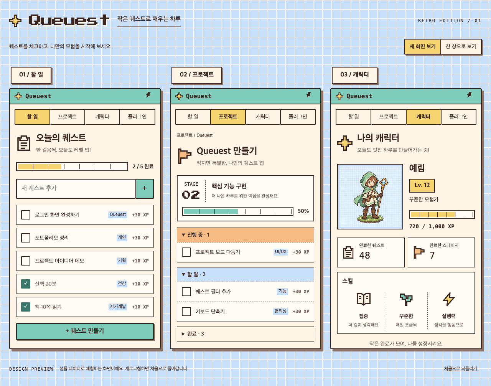
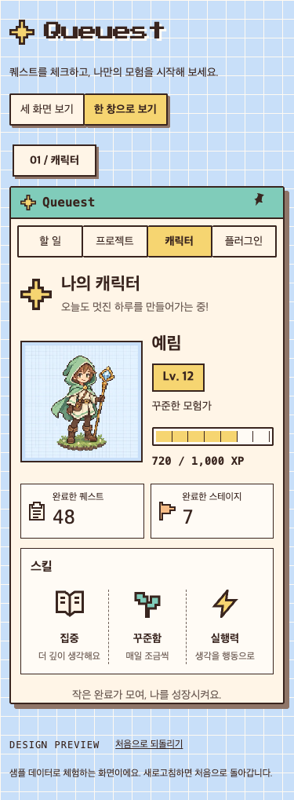

# Queuest 디자인 시스템

새 화면과 기능을 만들 때 사용하는 디자인 기준이다. 2026-09-11 사용자가 승인한 **레트로 웹 미리보기**의 시각적 일관성을 유지한다. 기존 화면을 단순히 비슷한 색으로 칠하는 것이 아니라 아이콘, 카드 구조, 간격, 글자 위계와 상태 표현까지 이어간다.

## 1. 기준과 적용 순서

1. 사용자의 최신 요청을 우선한다.
2. 시각적 기준은 [승인된 웹 미리보기](../previews/retro/dist/index.html)와 이 문서다. 미리보기 원본은 [마크업](../previews/retro/dist/app.js), [스타일](../previews/retro/dist/style.css)에 있다.
3. 실제 앱은 아래 공용 토큰·컴포넌트를 재사용한다. 웹과 앱 사이의 의도된 차이는 8절에 한정해 기록한다.
4. 원본 웹과 앱 구현이 다르면 기존 앱 코드를 무조건 정답으로 간주하지 않는다. 이 문서의 패턴 및 승인된 화면과 대조한 뒤 수정한다.

이 이미지는 디자인 참고 자료다. UI를 이미지로 붙여 구현하지 않는다. 화면의 예시 이름·숫자·XP는 실제 앱 데이터 규칙이 아니다.

## 2. 시각적 정체성

- 파란 모눈종이 위에 놓인 크림색 데스크톱 창.
- 민트색 타이틀바, 붙어 있는 탭, 금색 선택 상태.
- 짙은 갈색 윤곽선, 작은 각진 모서리, 번짐 없는 짧은 그림자.
- 픽셀 아이콘과 모험가 캐릭터. 한글 본문은 읽기 쉬운 시스템 글꼴.
- 데이터가 작아도 빈 공간을 장식용 통계나 가짜 보상으로 채우지 않는다.

큰 둥근 카드, 알약 모양의 기본 버튼, 흐린 그림자, 유리 효과, 장식용 그라데이션, 이모지 아이콘, 종이 테이프 장식을 새로 도입하지 않는다.

## 3. 공용 구현 위치

| 역할 | 재사용할 파일 |
|---|---|
| 색상·간격·글꼴·테두리 토큰 | [tokens.css](../apps/desktop/src/styles/tokens.css) |
| 창·타이틀바·탭·버튼·입력·포커스 | [retro-shell.css](../apps/desktop/src/styles/retro-shell.css) |
| 퀘스트·스테이지·캐릭터·플러그인 패턴 | [retro-content.css](../apps/desktop/src/styles/retro-content.css) |
| 공용 타이틀바 | [AppHeader.tsx](../apps/desktop/src/components/AppHeader.tsx) |
| 픽셀 아이콘 | [PixelIcon.tsx](../apps/desktop/src/components/PixelIcon.tsx) |
| 캐릭터 외형·직업·상태별 픽셀 렌더링 | [CharacterSprite.tsx](../apps/desktop/src/components/CharacterSprite.tsx) |
| 완료 퀘스트·완료 스테이지 카드 | [CharacterCompletionStats.tsx](../apps/desktop/src/components/CharacterCompletionStats.tsx) |
| 기존 레이아웃·동작 연결 | [App.tsx](../apps/desktop/src/App.tsx), [App.css](../apps/desktop/src/App.css) |

새 기능 전용 색상·버튼 체계를 만들지 않는다. `App.css`에 남은 과거 스타일보다 위의 레트로 스타일 계층을 기준으로 삼는다. 재사용되는 구조는 작은 컴포넌트로 만들고 같은 CSS 규칙으로 상태를 표현한다.

## 4. 디자인 토큰

### 색상

CSS에서는 아래 변수명을 사용한다. 새 값이 꼭 필요하면 용도를 이 문서에 먼저 정의하고 `tokens.css`에도 함께 추가한다.

| 토큰 | 값 | 용도 |
|---|---|---|
| `--ink` | `#39251f` | 본문·아이콘 윤곽·테두리 |
| `--ink-soft`, `--muted` | `#716159` | 부가 설명 |
| `--paper` | `#fff5e7` | 앱의 크림색 바탕 |
| `--paper-bright` | `#fffbf5` | 카드·입력·편집 패널 |
| `--paper-deep` | `#eadccc` | 중립 hover 표면 |
| `--mint` | `#80ccba` | 타이틀바·주요 버튼·진행 상태 |
| `--teal` | `#39776b` | 포커스·선택 체크박스 |
| `--blue` | `#c8dff9` | 바깥 배경·보조 배지·대기 상태 |
| `--gold` | `#f6d571` | 선택 탭·레벨·XP·hover |
| `--rust` | `#f6bc86` | 깃발·진행 중 상태 |
| `--error` | `#a44835` | 오류·위험 작업 |
| `--shadow` | `#8f7568` | 번짐 없는 그림자 |
| `--border-soft` | `#b49d8e` | 보조 구분선 |
| `--grid-line` | `#fffaf2` | 모눈선 |
| `--overlay` | `rgb(57 37 31 / 42%)` | 대화상자 배경 |

`--paper-cream`, `--muted-light`는 기존 코드 호환용 별칭이다. 새 코드에서는 의미가 같은 대표 토큰을 사용한다. 색상만으로 상태를 구분하지 말고 글자나 아이콘을 함께 둔다.

### 글꼴과 크기

| 토큰 | 크기 | 용도 |
|---|---|---|
| `--text-caption` | 11px | 짧은 보조 캡션 |
| `--text-small` | 12px | 메타데이터·통계 카드 라벨 |
| `--text-control` | 13px | 밀도 높은 앱 컨트롤 |
| `--text-body` | 14px | 본문·입력·퀘스트 제목 |
| `--text-large` | 16px | 소제목·강조 |
| `--text-heading` | 22px | 앱 화면 제목 |
| `--text-stat` | 24px | 완료 통계 숫자 |

- `--font-body`: Apple SD Gothic Neo, Malgun Gothic, sans-serif. 한글 본문에는 픽셀 폰트를 적용하지 않는다.
- `--font-mono`: ui-monospace, SFMono-Regular, monospace. XP 등 짧은 수치 정보에 사용한다.
- `--font-pixel`: 로컬 Press Start 2P. 로고와 제한된 장식용 숫자에 사용한다. 글꼴 파일과 라이선스는 `src/assets/`에 있다. 외부 Google Fonts 요청을 추가하지 않는다.
- 완료 통계 숫자는 원본 웹과 동일하게 `24px / 1.4 monospace`, 보통 굵기다. 카드 라벨은 `12px / 1.5`다.
- 일반 행간은 1.5, 설명은 1.6. 한글은 `word-break: keep-all`; 긴 사용자 입력·경로는 `overflow-wrap: anywhere`로 안전하게 줄바꿈한다.

### 간격·윤곽·깊이

- 간격은 `--space-1/2/3/4/5/6/8` = 4/8/12/16/20/24/32px를 사용한다.
- `--border`: 2px 실선 `--ink`. 창·주요 컨트롤의 외곽에 사용한다. 내부 카드·구분선은 1px.
- `--radius`: 2px. 붙어 있는 탭은 0px.
- 그림자는 blur 없이 창 4px, 편집창·대화상자 3px, 주요 버튼 2px 오프셋. 통계·퀘스트 카드에는 별도의 그림자를 추가하지 않는다.
- 모눈 크기는 24px, 선 두께는 1px. 콘텐츠 패널 안에 모눈을 반복하지 않는다.

## 5. 컴포넌트 패턴

### 창과 내비게이션

민트색 타이틀바 아래에 **할 일 / 프로젝트 / 캐릭터 / 플러그인** 탭을 둔다. 선택 탭은 금색과 굵은 글자로 표시한다. 타이틀바와 탭은 고정하고 `.main-content`만 세로 스크롤한다. 핀 버튼은 기존 창 고정 동작을 유지한다.

### 버튼·입력·오류

- `.primary-button`: 민트 표면, 2px 윤곽, 최소 높이 40px.
- `.secondary-button`: 밝은 크림 표면, 같은 윤곽과 크기.
- `.small-button`, `.row-action`: 밀도 높은 목록에서 최소 높이 34px.
- hover는 금색으로, 누름은 1px 이동으로 표현한다. disabled 상태에서는 실행하지 않는다.
- `:focus-visible`은 3px `--teal` 외곽선과 2px 간격. 포커스 표시를 제거하지 않는다.
- 입력은 밝은 크림 표면, 1px 윤곽, 최소 높이 40px, 본문 글꼴. placeholder로 label을 대신하지 않는다.
- 검증 메시지는 해당 필드 가까이에, 작업 실패는 `role="alert"`로 표시한다. 위험 작업은 `--error`를 사용한다.
- 편집창·대화상자는 동일한 크림색 창 문법을 사용하고, 작은 화면에서도 아래의 저장·취소 버튼까지 스크롤할 수 있어야 한다.

### 퀘스트·스테이지·진행률

퀘스트 행은 밝은 크림 바탕과 1px 윤곽, 각진 체크박스, 제목, 필요한 메타데이터·동작으로 구성한다. 완료 상태는 체크와 취소선으로 표시한다. 긴 제목 때문에 동작 버튼이 화면 밖으로 밀리지 않도록 한다.

진행률은 갈색 윤곽 안에 분할선이 있는 막대다. XP는 금색, 프로젝트 진행·스킬은 민트색. 값과 접근성 속성은 실제 도메인 계산을 따른다. 상태 보드는 대기 파랑·진행 중 주황·검토 금색·완료 민트색 헤더와 상태명을 함께 표시한다.

### 캐릭터 완료 카드: 반드시 유지할 구조

캐릭터 요약 아래, 스킬 위에 **같은 폭의 카드 두 개**를 나란히 둔다. 별도의 ‘활동 기록’ 제목이나 3열 통계로 대체하지 않는다.

| 항목 | 왼쪽 카드 | 오른쪽 카드 |
|---|---|---|
| 아이콘 | `clipboard` | `flag` |
| 라벨 | 완료한 퀘스트 | 완료한 스테이지 |
| 값 | 전체 프로젝트의 `done` 태스크 수 | 전체 프로젝트의 완료 마일스톤 수 |

- 아이콘은 왼쪽 가운데, 오른쪽에는 작은 라벨과 그 아래 큰 숫자.
- 두 열 사이 8px, 1px 갈색 윤곽, 밝은 크림색 바탕, 그림자 없음.
- 767px 이하: 카드 padding/gap 8px, 아이콘 24px. 그보다 넓을 때: padding/gap 12px, 아이콘 32px.
- 값이 0이어도 카드와 라벨을 유지한다. 원본 미리보기의 `48`, `7` 같은 예시 값을 복사하지 않는다.
- 완료 스테이지는 도메인의 `isMilestoneComplete`를 사용한다. 퀘스트가 하나 이상 있고 모두 완료되어야 한다. 빈 스테이지는 제외하며, 완료를 되돌리면 집계도 감소한다.
- 개인 인박스 완료는 이 프로젝트 기반 통계나 전역 XP에 임의로 합산하지 않는다.

웹 미리보기의 `adventurer.webp`는 디자인 참고 이미지다. 실제 앱에서는 최신 `main`의 `CharacterSprite` SVG 렌더러를 정사각형 파란 프레임에 표시해 직업·피부·머리·의상 선택과 퀘스트 상태 표현을 유지한다. 새 아이콘은 `PixelIcon`의 24×24 viewBox, 갈색 윤곽, 제한된 팔레트를 이어간다. 일반 이모지나 서로 다른 아이콘 스타일을 섞지 않는다.

### 빈 화면·로딩·기타 새 패널

같은 크림색 패널 안에서 짧고 구체적인 설명과 필요한 다음 동작을 보여준다. 빈 화면을 허구의 통계로 채우거나 무관한 장식을 추가하지 않는다. 로딩은 상태 텍스트로 표현하며, 장식용 무한 애니메이션을 만들지 않는다. 플러그인 연결·프로젝트 생성 등 새 기능도 기존 버튼·필드·배지·오류 패턴을 조합한다.

## 6. 움직임과 접근성

- 움직임은 클릭·상태 전환처럼 실제 사용자 동작을 설명할 때만 사용한다. 반복 장식 애니메이션은 사용하지 않는다.
- 애니메이션이 필요하면 transform/opacity 중심으로 구현하고 `prefers-reduced-motion`을 존중한다.
- 키보드로 모든 동작에 접근 가능해야 한다. 아이콘만 있는 버튼은 접근 가능한 이름이 필요하다. 장식용 SVG는 `aria-hidden`으로 처리한다.
- 주요 버튼은 최소 40px, 조밀한 목록 컨트롤은 최소 34px. 창의 높이가 작아져도 필요한 컨트롤을 숨기지 않는다.
- 텍스트 잘림, 한 글자만 남는 제목 줄바꿈, 가로 스크롤을 검수한다. 선택·완료·오류는 색상 이외의 표시를 함께 제공한다.

## 7. 새 기능 구현 절차

1. 이 문서와 해당 기능에 가까운 원본 웹 화면·공용 컴포넌트를 읽는다.
2. 들어갈 화면 위치, 재사용할 패턴, 데이터 출처, 정상·빈 값·로딩·오류 상태를 정한다.
3. 기존 토큰·컴포넌트를 재사용한다. 새 패턴이 필요하면 목적과 상태를 이 문서에 추가하고 공용 구현에도 반영한다. 페이지 안에서 별도 테마를 만들지 않는다.
4. 실제 저장 데이터와 이벤트를 연결한다. 미리보기 전용 fixture는 프로덕션 코드에 넣지 않는다.
5. `npm run check`와 변경에 맞는 기존 테스트를 실행한다. CSS·문구 확인을 위해 구현을 그대로 복제하는 테스트는 추가하지 않는다.
6. 실제 브라우저 또는 네이티브 화면에서 변경된 화면과 상태를 직접 조작한다. 375×640, 420×640, 768×900, 1280×900을 기준으로 넘침·한글·스크롤·포커스를 확인한다.
7. 원본 패턴을 옮겼다면 같은 콘텐츠 폭의 스크린샷으로 구조·간격·크기·색상·아이콘을 비교한다. 픽셀 차이 수치만으로 통과를 판단하지 않는다.
8. 변경한 파일, 확인한 동작과 화면, 확인하지 못한 환경을 기록한다. 브라우저 IPC fixture 검증을 실제 네이티브 저장소 검증으로 표현하지 않는다.

## 8. 웹 미리보기와 실제 앱의 의도된 차이

| 항목 | 적용 기준 |
|---|---|
| 바깥 레이아웃 | 웹의 로고·세 창 비교·미리보기 툴바·푸터는 소개용이다. 실제 앱에는 복사하지 않는다. |
| 창 크기 | 네이티브 팝오버는 기존 420×640 한계를 유지한다. 8px 바깥 여백, 44px 타이틀바, 38px 이상 탭을 사용한다. |
| 넓은 화면 | 760px 이상에서 앱 셸 최대 980px, 캐릭터 콘텐츠 최대 580px. 상태 보드는 560px 이하에서 세로 배치한다. 카드 내부 breakpoint는 원본의 767px을 따른다. |
| 실제 작업 도구 | 캐릭터 편집, 프로젝트 설정, 저장·취소, 오류 등 실제 기능의 컨트롤은 유지한다. 미리보기와 똑같이 만들기 위해 제거하지 않는다. |
| 데이터 | 이름·직업·레벨·XP·스킬·완료 수는 실제 도메인 규칙을 따른다. 원본의 예시 수치와 스킬 설명은 데이터 계약이 아니다. |
| 캐릭터 외형 | 최신 `main`의 실제 SVG 꾸미기·상태 렌더링을 유지한다. 웹의 고정 이미지를 덮어 씌워 외형 설정을 무효화하지 않는다. 기존 상태 애니메이션과 reduced-motion 대응도 유지한다. |
| 스킬 영역 | 현재 앱의 실제 스킬별 레벨과 진행 막대를 유지한다. 스킬 카드를 새로 바꾸는 작업은 별도 범위로 다룬다. |
| 기존 코드 | 큰 `App.tsx`와 과거 CSS는 남아 있다. 새 기능에서는 공용 컴포넌트를 재사용하되 디자인 작업에 무관한 전체 리팩터링을 묶지 않는다. |

의도된 차이를 새로 추가할 때에는 이유와 적용 범위를 이 절에 기록한다. 사용자가 지정한 원본 카드나 화면을 설명 없이 다른 구조로 대체하지 않는다.
